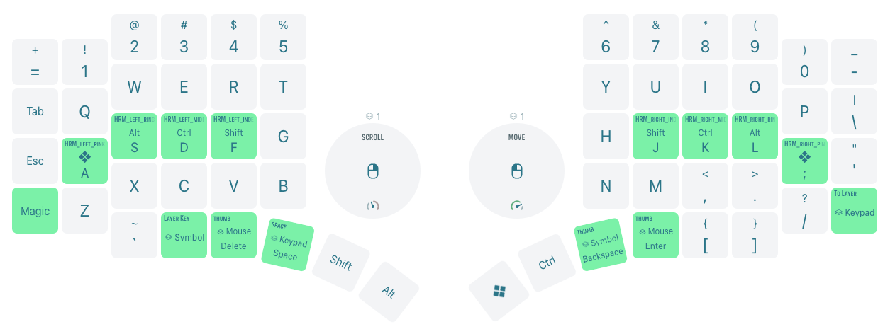
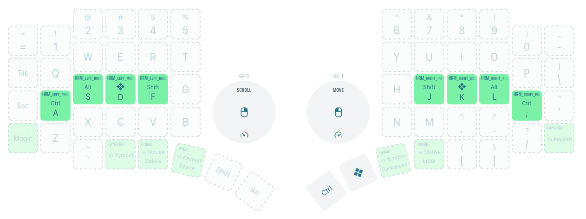
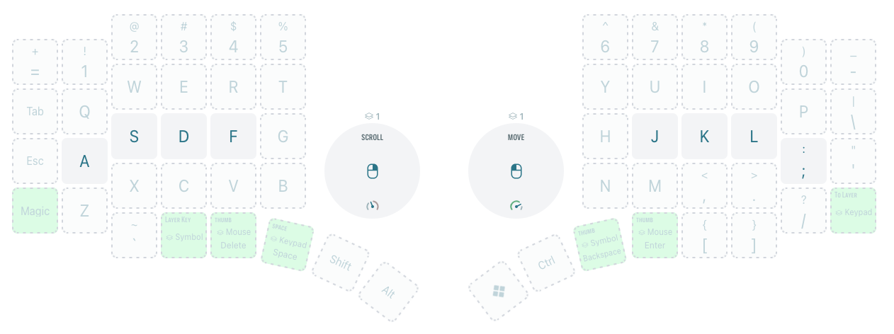
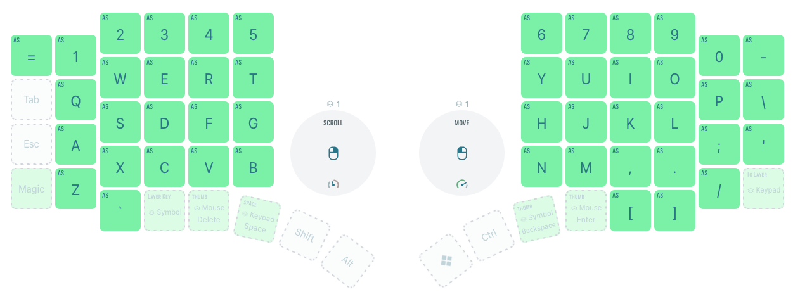
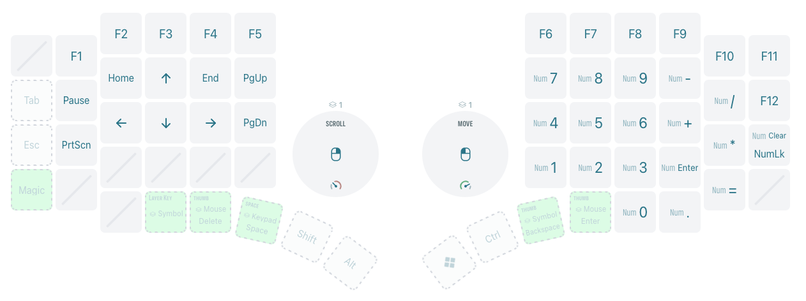
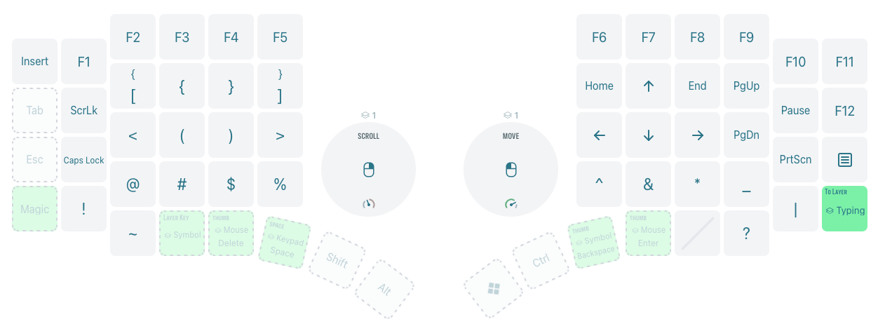
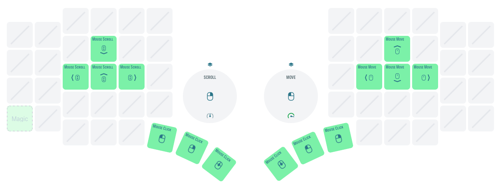
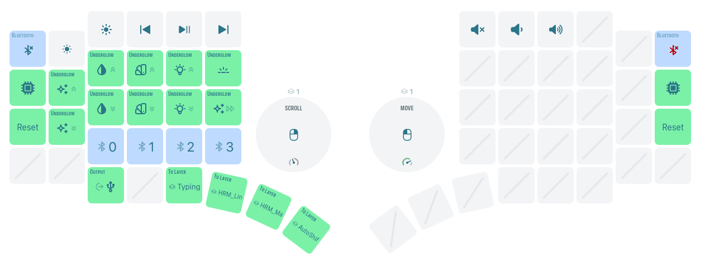

  

# MoErgo Go60 ZMK Config

This is my customized keyboard layout for the MoErgo Go60 split keyboard, designed as a clone and modification of the [TailorKey v4.2l](https://sites.google.com/view/tailorkey) Standard HRM Dual-OS configuration.

The original TailorKey layout is a zero-code, [Glorious Engrammer](https://github.com/sunaku/glove80-keymaps)–inspired design that uses only the Layout Editor’s native behaviors, requiring no custom-defined logic.

### Set of features:

- Dual-OS (MacOS / Linux) support
- Home-row modifiers (HRM)
- Basic typing layer
- AutoShift
- Dedicated keypad and symbol layers
- Mouse emulation
- Combo keys
- Optional RGB lighting

### Layers:

| 0. HRM_Linux                              | 1. HRM_MacOS                              |
| ----------------------------------------- | ----------------------------------------- |
|  |  |

| 2. Typing                          | 3. AutoShift                              |
| ---------------------------------- | ----------------------------------------- |
|  |  |

| 4. Keypad                           | 5. Symbol                           |
| ----------------------------------- | ----------------------------------- |
|  |  |

| 6. Mouse                          | 7. Magic                          |
| --------------------------------- | --------------------------------- |
|  |  |
